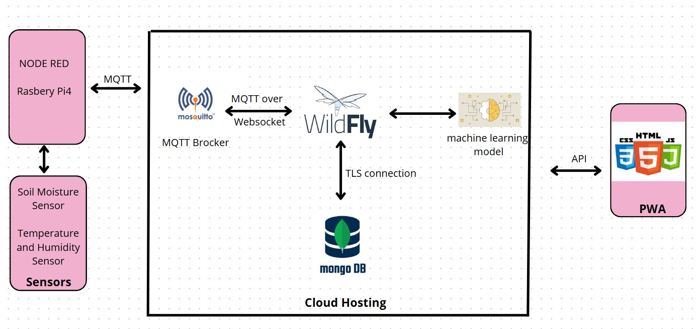

# 🌱 Plant Health Monitoring System
**A smart solution for next-generation agriculture using IoT, AI, and web technologies.**
## 🚀 Overview
This project was developed as part of an academic module, focusing on delivering an innovative solution to **monitor plant health** in real time. Leveraging **IoT sensors**, **AI models**, and a responsive **Progressive Web App (PWA)**, the system provides users with insightful data on plant environments and directs them to nearby agricultural centers when support is needed.

## 👨‍💻 Created by:
- Adam Ben Rhaiem
- Amir Jribi
- Mohamed Saket

## 📘 Description

The **Plant Health Monitoring System** is an end-to-end smart agriculture tool designed to:

- 📊 Monitor key environmental parameters like **temperature**, **humidity**, and **soil moisture**.
- 🤖 Use **AI models** to assess if environmental conditions are optimal for plant growth.
- 🗺️ Provide **location-based suggestions** for the nearest agricultural support centers.
- 📱 Display real-time data and insights via a modern, mobile-friendly **Progressive Web App (PWA)**.

## 🏗️ System Architecture

---

## 🧰 Technology Stack

### 🔧 Backend and Middleware
- **Jakarta EE**: Backend framework for managing application logic.
- **MongoDB**: Database for storing sensor data and user information.
- **Mosquitto Broker**: MQTT message broker for IoT communication.
- **Vanilla JavaScript**: Client-side scripting.

### 🌿 IoT Components
- **Raspberry Pi 4**: Microcontroller for sensor data acquisition.
- **DHT11 Sensor**: Captures temperature and humidity data.
- **Soil Moisture Sensor**: Measures soil water content.

### 🖥️ Frontend
- **PWA**: Progressive Web Application for real-time data visualization and interaction.

### 🧠 AI Model
- Machine Learning model for environmental condition assessment.

## 🛠️ Installation guide

We made sure that the architecture of the repository was well organized for users to test the project locally or build on it. If you want to run the application locally, please follow the following steps:

    - Clone the repo: git clone https://github.com/Amir-Jribi/Fire-Detection
    - Install Wildfly30, with Java 21.
    - Install Nodered on your Raspberry pi and then load the content of embedded folder into your raspberry pi. Feel free to change the sensors and actuators pins, the MQTT broker, and the API link for getting a list of installed sensors.
    - Configure  HTTPS/HSTS for Wildfly.
    - Open microprofile.config.properties and set your settings (certificate path, MQTT broker settings, and you Mongodb link).
    - Move into the Health-monitoring directory and run nvm clean package to install the required dependencies.
    - Deploy the war file created in the target forlder in the deployment folder, and start your wildfly server. 
# 🌐 Deployment (Cloud Hosting)
The Application is also hosted on a virtual machine accessible at https://planthealth.me/
With our school mail, we can get a 100$ voucher inside of Microsoft Azure. With this voucher, we can create a virtual machine capable of hosting the middleware, the mosquitto broker and the database. The virtual machine have the following characteristics:
- Ram: 4GB
- vCPUS: 2
- Ressource disk size: 8GB
# 🔐 Security and Certification
- Enforced HTTPS with Let's Encrypt TLS certificates
- Enabled HSTS for strict transport security
- Limited to TLS 1.3 only
- Achieved A Grade on SSL Labs

